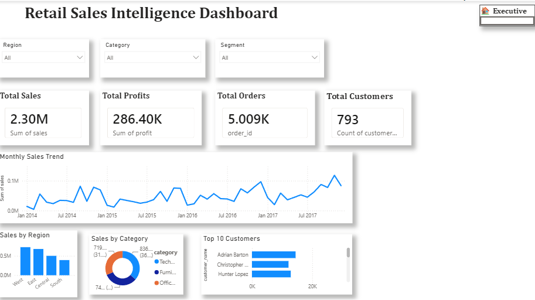
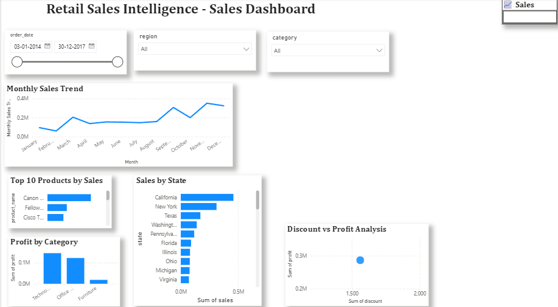
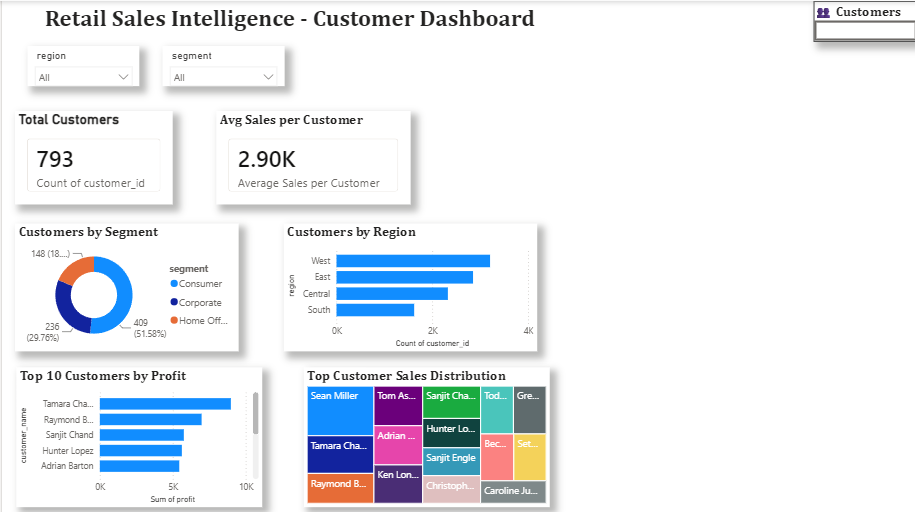
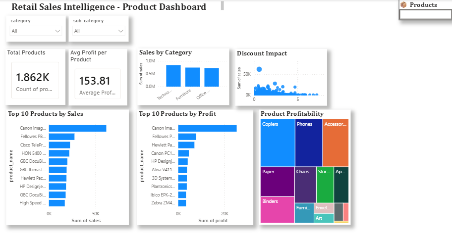

# 🛒 Retail Sales Intelligence Platform

An end-to-end Retail Sales Intelligence Platform built using **Python, PostgreSQL, FastAPI, Power BI, and Machine Learning**.

This project demonstrates a complete analytics workflow—from raw retail sales data ingestion to ETL, data warehousing, REST APIs, interactive dashboards, sales forecasting, and automated report generation.

---

# 📌 Project Overview

The platform helps businesses analyze retail sales performance by providing:

- 📊 Executive Dashboard
- 💰 Sales Analytics
- 👥 Customer Analytics
- 📦 Product Analytics
- 📍 Regional Performance
- 📈 Sales Forecasting
- 📄 Automated Excel & PDF Reports
- 🚀 REST APIs using FastAPI

---

# 🏗️ Project Architecture

```text
CSV Dataset
      │
      ▼
Python ETL Pipeline
      │
      ▼
PostgreSQL Database
      │
      ▼
Data Warehouse
      │
      ▼
FastAPI REST APIs
      │
      ▼
Power BI Dashboards
      │
      ▼
Forecasting & Reports
```

---

# 📁 Project Structure

```text
Retail-Sales-Intelligence
│
├── backend/
│   ├── app/
│   │   ├── api/
│   │   ├── models/
│   │   ├── schemas/
│   │   ├── services/
│   │   ├── config.py
│   │   ├── database.py
│   │   └── main.py
│
├── config/
├── data/
├── docs/
│   ├── executive_dashboard.png
│   ├── sales_dashboard.png
│   ├── customer_dashboard.png
│   └── product_dashboard.png
│
├── etl/
├── forecast/
├── logs/
├── reports/
├── sql/
├── warehouse/
├── tests/
│
├── logger.py
├── requirements.txt
├── README.md
├── Dockerfile
└── docker-compose.yml
```

---

# 🚀 Features

## ✅ ETL Pipeline

- Load Raw Dataset
- Data Cleaning
- Data Validation
- Data Transformation
- PostgreSQL Loading

---

## ✅ PostgreSQL

- Raw Data Storage
- Warehouse Schema
- Advanced SQL Queries
- Views
- Indexes

---

## ✅ FastAPI Backend

REST APIs available:

| Endpoint | Description |
|----------|-------------|
| `/` | Home |
| `/health` | Health Check |
| `/dashboard` | KPI Summary |
| `/sales` | Monthly Sales |
| `/customers` | Customer Analytics |
| `/products` | Product Analytics |
| `/regions` | Regional Analytics |

Swagger Documentation:

```
http://localhost:8000/docs
```

---

# 📊 Power BI Dashboards

## Executive Dashboard



---

## Sales Dashboard



---

## Customer Dashboard



---

## Product Dashboard



---

# 📈 Sales Forecasting

Implemented using:

- Prophet
- Pandas
- PostgreSQL

Features:

- 30-Day Forecast
- 90-Day Forecast
- Historical Trend Analysis

---

# 📄 Automated Reports

Generated using Python.

### Excel Report

- Sales Summary
- Customer Summary
- Product Summary

### PDF Report

Contains:

- KPIs
- Summary
- Forecast Overview

---

# 📚 Tech Stack

## Programming

- Python

## Database

- PostgreSQL

## Backend

- FastAPI
- SQLAlchemy

## Data Analysis

- Pandas
- NumPy

## Machine Learning

- Prophet

## Visualization

- Power BI

## Reporting

- OpenPyXL
- ReportLab

## Version Control

- Git
- GitHub

---

# ⚙️ Installation

Clone Repository

```bash
git clone https://github.com/YOUR_USERNAME/Retail-Sales-Intelligence.git
```

Move into project

```bash
cd Retail-Sales-Intelligence
```

Create virtual environment

```bash
python -m venv venv
```

Activate

Windows

```bash
venv\Scripts\activate
```

Install dependencies

```bash
pip install -r requirements.txt
```

Run FastAPI

```bash
uvicorn backend.app.main:app --reload
```

Open

```
http://127.0.0.1:8000/docs
```

---

# 📊 Technologies Used

- Python
- PostgreSQL
- SQLAlchemy
- FastAPI
- Power BI
- Prophet
- OpenPyXL
- ReportLab
- Pandas
- NumPy
- Git
- GitHub

---

# 📈 Future Improvements

- Docker Deployment
- CI/CD Pipeline
- Authentication (JWT)
- Email Notifications
- Cloud PostgreSQL
- Render Deployment
- Power BI Service Integration

---

# 👨‍💻 Author

**Sumit Bera**

B.Tech – Computer Science & Engineering

BIT Sindri

GitHub:

```
https://github.com/sumit-bera-0805
```

LinkedIn:

```
Add your LinkedIn profile here
```

---

# ⭐ If you found this project useful

Please consider giving this repository a ⭐ on GitHub.